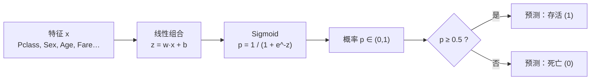

# Titanic 存活预测（逻辑回归）

> **数据**：seaborn 内置 `titanic` 数据集（源自 Kaggle Titanic 竞赛 <https://www.kaggle.com/c/titanic>）

一个最小可复现的机器学习**二分类**项目：根据乘客的舱位、性别、年龄、票价等信息，用**逻辑回归（Logistic Regression）**预测其在泰坦尼克号上是否幸存。

> 数据（pandas）+ 建模（sklearn）+ 可视化（matplotlib/seaborn）三合一。

## 这是什么任务：分类，不是回归

逻辑回归名字里带“回归”，但它解决的是**分类**问题（本项目的 `Survived` 只有 0 / 1 两个取值）。

| | 线性回归 Linear Regression | 逻辑回归 Logistic Regression |
|---|---|---|
| 任务类型 | 回归：预测连续数值 | 分类：预测类别（0/1） |
| 输出 | 任意实数 | 0~1 之间的概率 |
| 核心公式 | y = wx + b | p = sigmoid(wx + b) |
| 损失函数 | MSE | 交叉熵 Cross-Entropy |
| 评估指标 | MAE / RMSE / R² | 准确率 / 混淆矩阵 / 精确率 / 召回率 |
| 对应项目 | admission-predict、walmart-sales | **本项目** |

## 每一步做了什么

### 1. 读数据

```python
df = pd.read_csv("titanic.csv")
```

数据共 891 行、8 列：`survived`（0/1）、`pclass`、`sex`、`age`、`sibsp`、`parch`、`fare`、`embarked`。

### 2. 预处理

- `age` 有 177 个缺失 → 用**中位数填补**（删掉会损失约 20% 样本）；
- `embarked` 只有 2 个缺失 → 直接删掉这两行；
- `sex`、`embarked` 是类别特征 → 用 `pd.get_dummies(..., drop_first=True)` 转成 0/1。

### 3. 划分训练 / 测试集

```python
train_test_split(X, y, test_size=0.2, random_state=42, stratify=y)
```

- `test_size=0.2`：20% 作测试集；
- `random_state=42`：固定随机种子，保证结果可复现；
- `stratify=y`：按标签比例分层抽样，保证训练/测试集里“存活/死亡”比例一致。

### 4. 训练

```python
model = LogisticRegression(max_iter=1000)
model.fit(X_train, y_train)
```

`max_iter=1000` 是优化器最多迭代次数（防止还没收敛就被截断）。

### 5. 评估

- 准确率 `accuracy_score`；
- 混淆矩阵热力图；
- 特征重要性（逻辑回归系数）条形图。

## 逻辑回归知识点

### 从线性到概率：sigmoid

线性回归输出任意实数，可能预测出 `1.3` 或 `-0.2` 这种无意义的“概率”。逻辑回归在线性输出外再套一层 **sigmoid**：

```
sigmoid(z) = 1 / (1 + e^-z)
```

它把任意实数压到 `(0, 1)` 区间，得到一个真正的概率：



### 决策边界与阈值

取阈值 `0.5`：`p ≥ 0.5` 判为 1，否则判为 0。阈值可以按需要调整（例如更看重召回率时调低）。

### 为什么叫“回归”：log-odds

逻辑回归内部其实是在拟合**对数几率（log-odds）**：

```
log( p / (1 - p) ) = w·x + b
```

左边是线性形式，所以叫“回归”；右边解出 `p` 就是 sigmoid。这个式子也说明：**每单位 x 的变化，会让 odds（p/(1-p)）乘以 e^w**。

### 损失函数：交叉熵

```
L = -(1/n) Σ [ y·log(p) + (1-y)·log(1-p) ]
```

- `y=1` 时只惩罚 `-log(p)`：预测概率越接近 0，惩罚越大；
- 分类用交叉熵而不是 MSE，是因为 MSE 在概率输出上**梯度容易趋近 0**（学习慢），交叉熵梯度更陡、收敛更快。

### 系数解读

本例标准化后的系数：
- `sex_male = -2.55`：男性显著降低存活概率（绝对值最大）；
- `pclass = -1.02`：舱位等级越低，存活概率越低；
- 结论与史实一致：**女性和高舱位乘客优先获救**。

### 评估指标

- **准确率**：预测对的比例（类别不平衡时可能失真）；
- **混淆矩阵**：`[[TN, FP], [FN, TP]]`，能看出模型在哪类上犯错；
- **精确率 / 召回率 / F1**：更关注某一类时的指标。

## 结果

| 指标 | 数值 |
|---|---|
| 测试集准确率 | **0.815**（178 个样本） |
| 随机基线（全猜“死亡”） | 0.618 |
| 相比基线提升 | **约 +20 个百分点** |

混淆矩阵（真实 \ 预测）：

| | 预测 Died | 预测 Survived |
|---|---|---|
| **实际 Died** | 98 | 12 |
| **实际 Survived** | 21 | 47 |

## 运行

```bash
pip install -r requirements.txt
python titanic_logreg.py
```

## 文件结构

```
titanic-logreg/
├── titanic.csv                # 数据（891 行 × 8 列）
├── titanic_logreg.py          # 主脚本
├── requirements.txt           # 依赖
├── README.md
└── output/
    ├── confusion_matrix.png
    └── feature_importance.png
```
